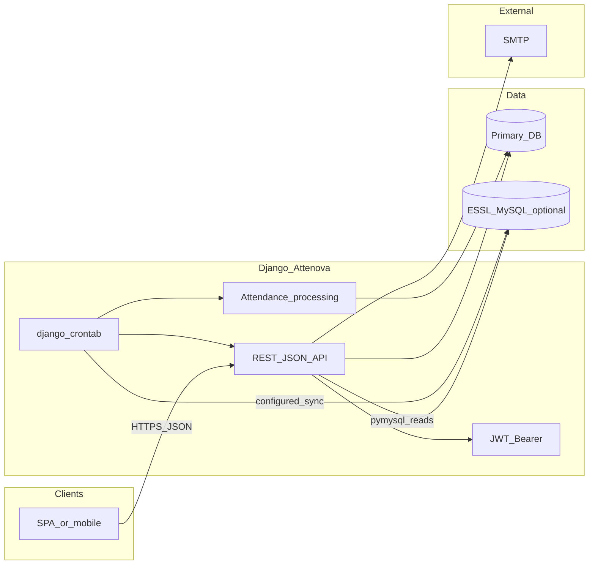
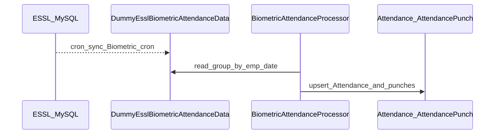

# Attenova — System Architecture

**Flow diagram, ER diagram, and export instructions:** [DIAGRAMS.md](DIAGRAMS.md) · raw Mermaid: [diagrams/attenova_software_flow.mmd](diagrams/attenova_software_flow.mmd), [diagrams/attenova_er.mmd](diagrams/attenova_er.mmd)

## High-level stack

| Layer | Technology |
|-------|------------|
| Web/API | Django 5.2, `django.views.View` JSON endpoints, `csrf_exempt` + custom JWT ([`Users/auth_utils.py`](../Users/auth_utils.py)) |
| Cross-origin | `django-cors-headers`, `CSRF_TRUSTED_ORIGINS` aligned with CORS ([`Attenova/settings.py`](../Attenova/settings.py)) |
| Primary DB | Configurable: SQLite (default), PostgreSQL, or MySQL via `ATTENOVA_DB_*` env vars |
| External biometric DB | Optional MySQL `essl_db` when `ESSL_DB_NAME` is set; used for live ESSL `DeviceLogs`-style reads ([`Biometric/views.py`](../Biometric/views.py) `essl_device_logs`) |
| Scheduling | `django-crontab`: every 5 minutes attendance sync; daily 1 AM email report ([`Attenova/settings.py`](../Attenova/settings.py) `CRONJOBS`) |
| Email | Django email backend (env-driven; console in dev) for HTML + Excel reports ([`Reports/email_report.py`](../Reports/email_report.py)) |

## Logical architecture (C4-style context)

## Multi-tenancy and access model

- **Tenant hierarchy**: `Organization` → `Office` → `Employee` / `Shift` / `BiometricDevice` ([`Organization/models.py`](../Organization/models.py), [`Employee/models.py`](../Employee/models.py)).
- **Users**: Custom `Users.User` (`AUTH_USER_MODEL`) with `UserRole` (org admin, office admin, office manager, supervisor), `organization` FK, optional `office` scoping ([`Users/models.py`](../Users/models.py)).
- **Authorization pattern**: Shared helpers in [`Organization/access.py`](Organization/access.py): `user_can_access_office`, `get_offices_queryset`, `is_superadmin`. Employee app reuses `get_employees_queryset` / `user_can_access_employee` / `apply_list_filters` for roster scope.

## Django apps (bounded contexts)

| App | Responsibility |
|-----|----------------|
| **Users** | Login, `/me`, JWT issuance |
| **Organization** | Organizations, offices, manager M2M |
| **Employee** | Roster; `emp_code` = ESSL user id; optional `user` OneToOne |
| **Shifts** | Per-office `Shift` (grace, night shift, default shift constraint) |
| **Biometric** | `BiometricLog` (immutable raw), `DummyEsslBiometricAttendanceData` (staging mirror of DeviceLogs), `BiometricDevice` → office; ESSL log API; [`Biometric/cron.py`](../Biometric/cron.py) for scheduled ESSL pull + processing |
| **Attendance** | `Attendance`, `AttendancePunch`, regularization models, `BiometricAttendanceProcessor` ([`Attendance/processing.py`](../Attendance/processing.py)) |
| **Reports** | Attendance report API, Excel build, email orchestration ([`Reports/utils.py`](../Reports/utils.py)) |
| **Notifications** | Generic FK notifications (e.g. regularization) ([`Notifications/models.py`](../Notifications/models.py)) |

## API surface (root router)

Central routing in [`Attenova/urls.py`](../Attenova/urls.py):

- `api/auth/` → Users
- `api/organizations/`, `api/offices/`
- `api/employees/`, `api/shifts/`, `api/biometric/`, `api/attendance/`, `api/reports/`, `api/notifications/`

## Data flow: biometric → attendance

- **Cron pipeline** ([`Biometric/cron.py`](../Biometric/cron.py)): When `essl_db` is configured, `run_attendance_sync` pulls new rows from `ESSL_DEVICE_LOGS_TABLE` into `DummyEsslBiometricAttendanceData` (cursor: `MAX(DeviceLogId)`), then runs `BiometricAttendanceProcessor` for the last 7 calendar days. If ESSL is not configured, only the processing step runs (e.g. seeded or manually loaded dummy data).
- **Processing path**: [`BiometricAttendanceProcessor`](../Attendance/processing.py) reads **`DummyEsslBiometricAttendanceData`**, not `BiometricLog` directly.
- **ESSL read path**: Authenticated endpoint aggregates from configured `DeviceLogs_*` table via `pymysql` when `essl_db` exists ([`Biometric/views.py`](../Biometric/views.py)).
- **Management command**: [`process_attendance_from_biometric`](../Attendance/management/commands/process_attendance_from_biometric.py) wraps the processor for manual or alternate scheduling.

## Scheduled jobs

From [`CRONJOBS`](../Attenova/settings.py):

1. `*/5 * * * *` → `Biometric.cron.run_attendance_sync` (ESSL pull + attendance processing)
2. `0 1 * * *` → `send_daily_attendance_report` ([`Reports/management/commands/`](../Reports/management/commands/))

After adding `python manage.py crontab add`, ensure the system cron user can run Django with the correct `SECRET_KEY` and database env vars.

## Security and configuration

- Secrets and DB selection via environment variables ([`Attenova/settings.py`](../Attenova/settings.py)); `SECRET_KEY` required.
- JWT signed with `SECRET_KEY`, 7-day expiry ([`Users/auth_utils.py`](../Users/auth_utils.py)).
- Media for employee profile images served in `DEBUG` only via `static()` helper on URLs.

## Deployment notes

- **django-crontab**: Install cron entries with `python manage.py crontab add` on the server; use the same virtualenv and working directory as the app.
- **ESSL schema**: The sync query expects `DeviceLogs`-style columns (`DeviceLogId`, `UserId`, `LogDate`, `Direction`, etc.). If your ESSL table differs, adjust [`Biometric/cron.py`](../Biometric/cron.py) `sync_essl_device_logs_to_dummy` or set `ESSL_DEVICE_LOGS_TABLE` to a compatible view.
- **Reverse proxy**: Terminate TLS at nginx/Caddy/Apache and forward to Gunicorn/uWSGI; set `ALLOWED_HOSTS`, `CSRF_TRUSTED_ORIGINS`, and `CORS_ALLOWED_ORIGINS` for your frontend origin.
