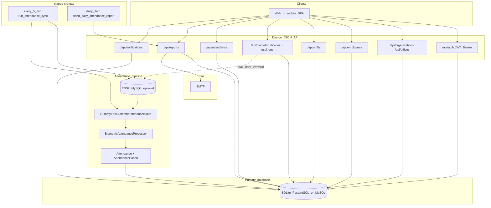
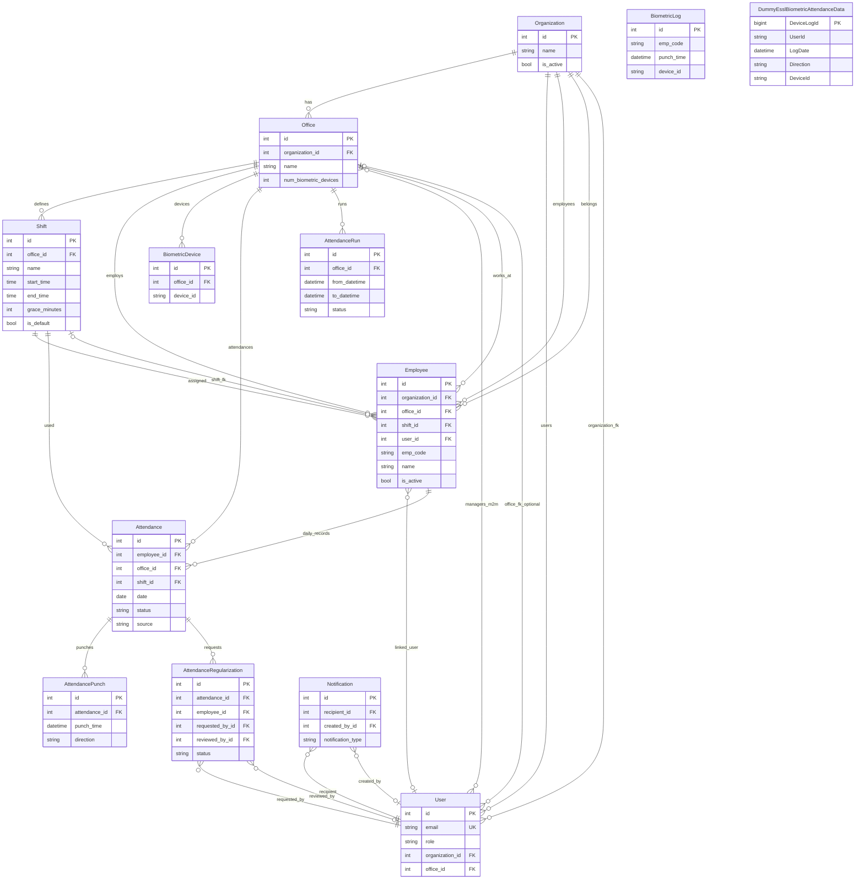
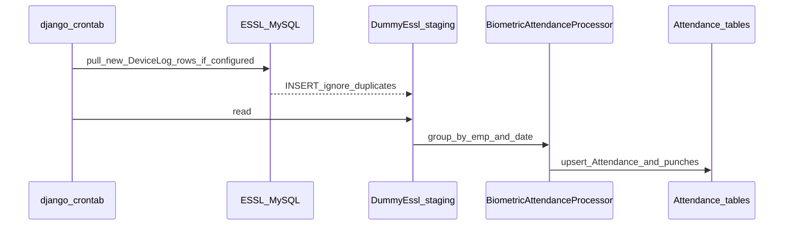

# Attenova — Flow and ER diagrams

This page contains **Mermaid** source for the software flow and the database ER view. You can preview it in GitHub, VS Code / Cursor (Mermaid preview), or export images (see [Download as PNG or SVG](diagrams/README.md)).

---

## 1. Software flow diagram

High-level paths: SPA → JSON APIs → primary DB; cron → ESSL (optional) → staging table → attendance processor; daily report → SMTP.

---

## 2. ER diagram (core entities)

Relationships reflect Django models: multi-tenant org/office, users, employees, shifts, attendance, punches, regularization, biometric staging, notifications. `BiometricLog` and `DummyEsslBiometricAttendanceData` are not FK-linked to `Employee` in the schema; matching is by `emp_code` / `UserId` at processing time.

---

## 3. Attendance pipeline (sequence)

Cron and optional ESSL sync into the app database, then processing into `Attendance`.

---

## Source files

| File | Purpose |
|------|---------|
| [`diagrams/attenova_software_flow.mmd`](diagrams/attenova_software_flow.mmd) | Flow diagram (Mermaid only) |
| [`diagrams/attenova_er.mmd`](diagrams/attenova_er.mmd) | ER diagram (Mermaid only) |

See [diagrams/README.md](diagrams/README.md) for **exporting PNG or SVG** to download.
